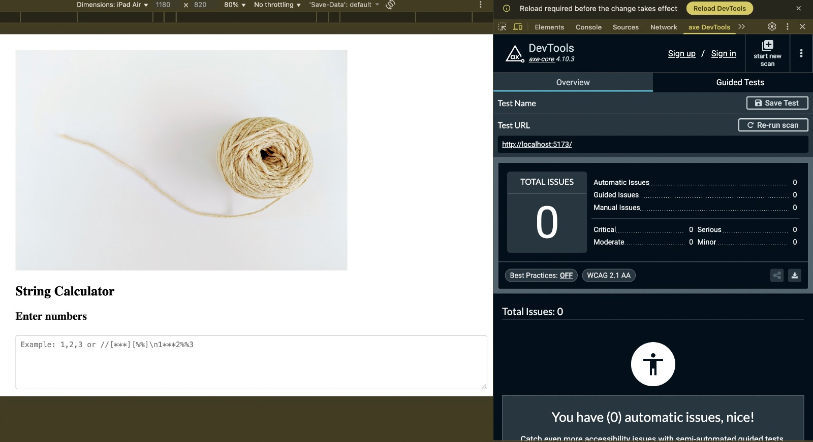

# Incubyte String Calculator Template

## Overview

This project contains a **String Calculator template** built using React. The primary goal is for candidates to implement the functionality and improve accessibility in the provided UI component.

## Project Structure

- **src/**
  - `App.tsx`: The React component with accessibility issues.
  - `stringCalculator.ts`: Implementation of the String Calculator logic (to be developed).
- **tests/**
  - `stringCalculator.test.ts`: Suite of tests for the String Calculator functionality (to be developed).

## Getting Started

1. **Clone the Repository**

   ```bash
   git clone https://github.com/yourusername/string-calculator.git
   cd string-calculator
   ```

2. **Install Dependencies**

   ```bash
   npm install
   ```

3. **Run the Application**

   ```bash
   npm start
   ```

4. **Run Tests**

   ```bash
   npm test
   ```

## Task for Candidates

- Implement the functionality of the String Calculator following TDD best practices.
- Resolve accessibility issues in the `App.tsx`.


# Accessibility Enhancements and Testing done

## Summary
This update improves the overall accessibility of the application and adds automated accessibility testing to ensure compliance with WCAG standards.

## Changes Made
- Added ARIA labels and descriptive attributes (`aria-label`, `role`, `aria-describedby`) to key interactive UI elements.
- Ensured keyboard navigability for all focusable elements.
- Improved semantic structure for screen readers.
- Verified focus indicators and label associations for better usability.
- Integrated automated accessibility testing using **jest-axe** with **@testing-library/react**.
- Configured **Vitest** environment (`jsdom`) with a setup file for accessibility matchers.
- Added test cases to validate that the application has **no accessibility violations**.
- All accessibility tests are now passing successfully.

## Tools and Libraries
- **React (Vite + SWC)**
- **Vitest**
- **@testing-library/react**
- **jest-axe**
- **@testing-library/jest-dom**

## Outcome
The UI is now accessible for:
- Regular users  
- Screen readers  
- Keyboard navigation  

All accessibility checks pass with zero violations.

## Accessibility Testing results



